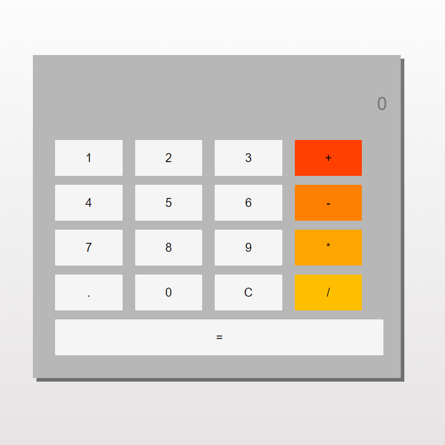

# SimpleCalculator

https://rutik675lt.github.io/SimpleCalculator/



SimpleCalculator is a minimalist and visually appealing web-based calculator built using HTML and CSS. It's designed to perform basic arithmetic operations and provides a user-friendly interface for quick calculations.

## Features

- **Basic Operations:** Supports addition, subtraction, multiplication, and division.
- **Interactive Buttons:** Clear, delete, and evaluate operations.

## Getting Started

### Prerequisites

No prerequisites are needed for running the SimpleCalculator, as it runs directly in the browser without any additional setup.

### Running Locally

To run SimpleCalculator on your local machine:

1. Clone the repository:
   ```bash
   git clone https://github.com/your-username/SimpleCalculator.git
